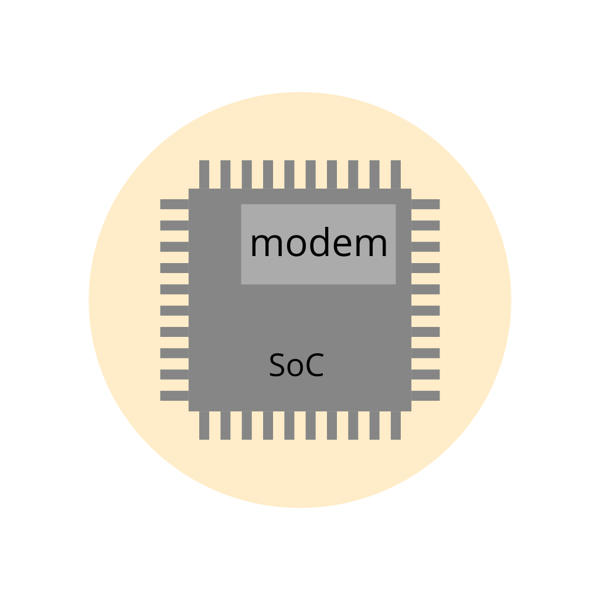
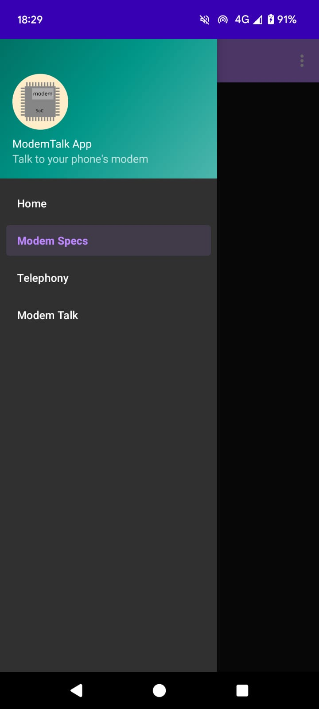

# ModemTalk
In Android phones that have a MediaTek [SoC](https://en.wikipedia.org/wiki/System_on_a_chip), it is more straight-forward to talk to the modem, i.e. the [IP block](https://en.wikipedia.org/wiki/Semiconductor_intellectual_property_core) responsible for telecommunications (LTE, 4G, 5G, etc.).

This app helps you to do so.

Example screenshot:

## Tested phones

* [Xiaomi Redmi 9A](https://www.gsmarena.com/xiaomi_redmi_9a-10279.php) (model M2006C3LG)
* [Xiaomi Redmi 6A](https://www.gsmarena.com/xiaomi_redmi_6a-9217.php) (model M1804C3CG)

## Tips

* The MediaTek EngineerMode [APK](https://en.wikipedia.org/wiki/Apk_(file_format)) is  usually found in <code>/system/priv-app/EngineerMode/EngineerMode.apk</code>
