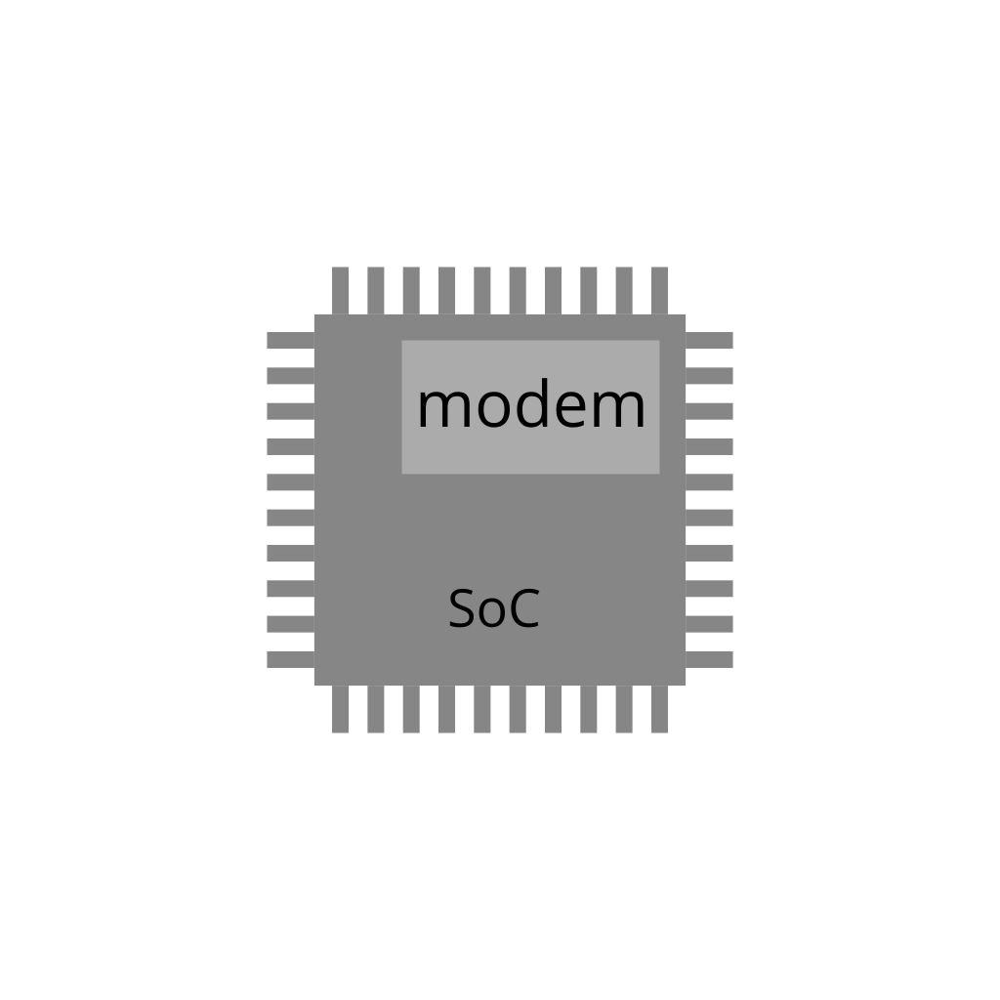

# ModemTalk
In Android phones that have a MediaTek SoCs, it is more straight-forward to talk to the modem, i.e. the chip (or ic block) responsible for telecommunications (LTE, 4G, 5G, etc.).

This app helps you to do so.

<!--  -->

